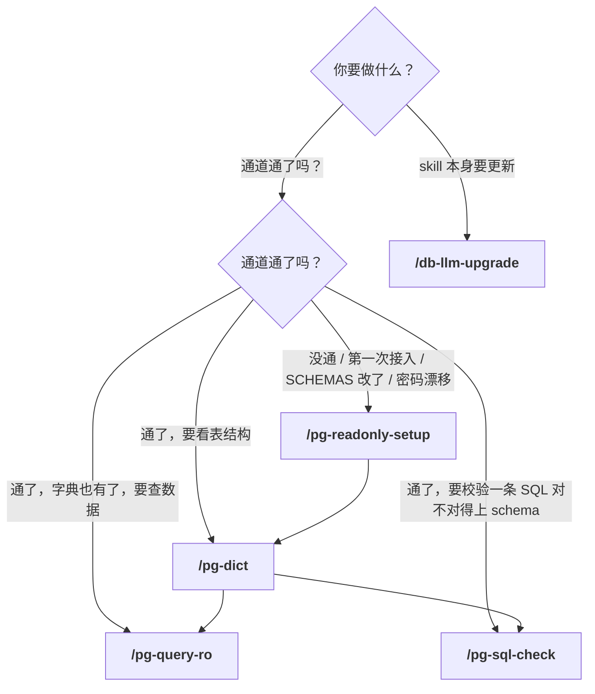
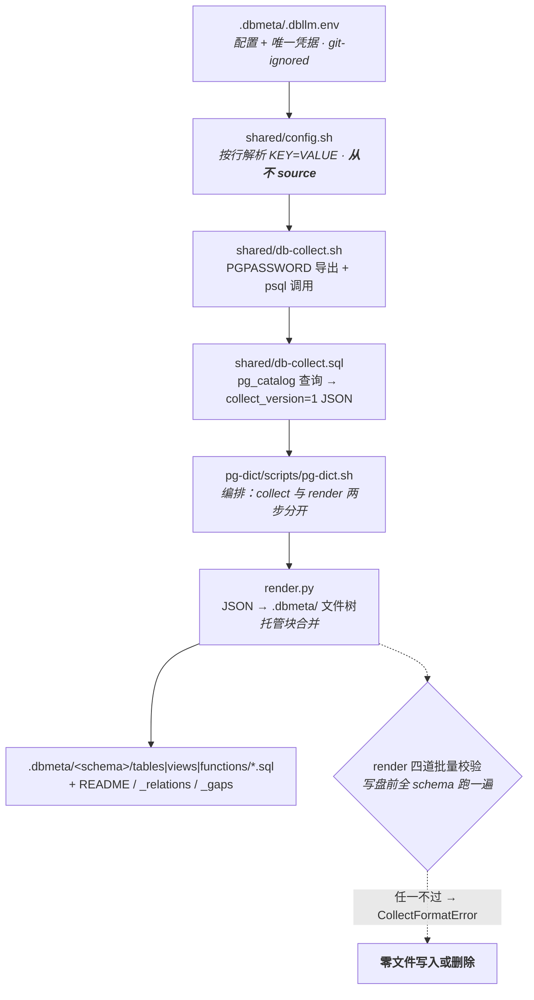
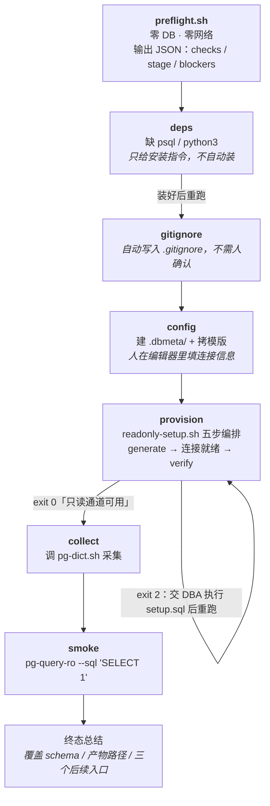
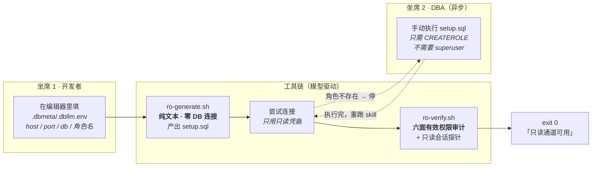
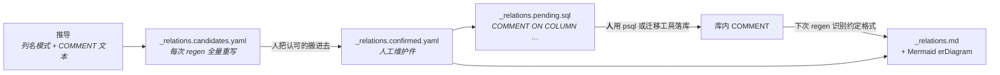
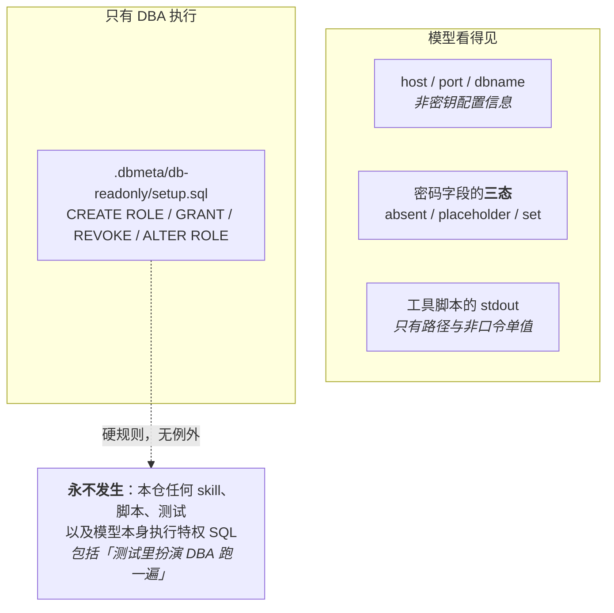

# db-llm 使用说明（给人读）

本仓有 **4 个已实现的 skill**，管的是「大模型怎么安全地访问一个已有 PostgreSQL 库」——
数据字典 / 只读查询 / SQL 预校验 / 只读角色开通。这份文档回答的是人的三个问题：
**我该用哪个 · 按什么顺序 · 卡住了在哪一格**。

各 `SKILL.md` 是给 Claude / Codex 读的操作手册（参数表、退出码、MUST/MUST NOT），人不必看；
本页只讲人该做什么。

> 前提：本机已按 [README「安装」](../README.md#安装) 装好 db-llm。
> 姊妹仓 `laodao-ai/pg-ops-skills` 管「把 PostgreSQL 服务本身立起来并运维」（装机 / 建库 / 备份 / 同步），
> 两仓经文档级消费关系相连（ADR-0008）、
> 无代码依赖——本仓自己开发/测试时也是 `pg-ops` 的消费项目，用它的 `/pg-dev-init` 建自己的测试库。

---

## 1. 我该用哪个 skill



一句话触发表（在**项目仓根目录**对 Claude / Codex 说）：

| 你想做的事 | 说这句 | 会跑的 skill |
|---|---|---|
| 新仓接入只读通道 | 「配置只读通道」/「接入向导」 | `pg-readonly-setup` |
| 生成 / 刷新数据字典 | 「生成数据字典」/「再生字典」 | `pg-dict` |
| 查一下数据 | 「看看这张表有什么」/「跑个 SQL」 | `pg-query-ro` |
| 校验一条 SQL 对不对得上真实 schema | 「校验这条 SQL」/「这条语句列名对不对」 | `pg-sql-check` |
| 升级 skill 套件 | 「升级 db-llm」 | `db-llm-upgrade` |

**不要**手动一个个跑前置 skill——`pg-readonly-setup` 会自己编排 `pg-dict` 与 `pg-query-ro`。
人只说一句话。

---

## 2. 安装与升级

```bash
# 首次：运行 checkout 是真 clone，不软链到开发仓
git clone https://github.com/laodao-ai/db-llm-skills.git ~/.skills/db-llm-skills
bash ~/.skills/db-llm-skills/setup.sh          # 幂等；Unix symlink，Windows 拷贝
```

`setup.sh` 把 5 个 skill symlink 到 `~/.claude/skills/` 与 `~/.codex/skills/`，任何 PG 项目全局可用。


之后升级说「升级 db-llm」即可（`/db-llm-upgrade`）：`git pull --ff-only` → `setup.sh` → 显示版本与最近 5 条变更。
退出码 `0` 成功 / `1` pull 层失败 / `2` setup 失败，每个失败分支都给 problem/cause/fix 三件套。

> **运行 checkout 只读**。改代码在另一份开发 checkout 里做、push 之后在运行机跑升级。
> 运行 checkout 被改过会导致非 ff，升级会停下报告而**不会**强推。

---

## 3. 三阶段管线

本仓是一条严格的三段链，**collect 与 render 是两个分开的步骤**（不是管道）——
失败能钉到具体一层，且 collect 失败时**零个** `.dbmeta/` 文件被写。



三条设计不变量，理解它们就不会误判「是不是坏了」：

- **采集范围随 payload 走，不走 CLI 开关**（ADR-0004）——`requested_schemas` 是采集 JSON 里的一个字段，
  范围与结果永远不会各说各话。
- **托管块合并**：块内（`-- pg-dict:<kind>:<name>:start/end` 之间）每次再生整体重写；
  **块外人工注记逐字保留**。对象文件是可执行 `.sql`，所以人工注记 MUST 写成 `--` 注释行。
- **幂等**：schema 没变时连跑两次，`.dbmeta/` 下全部文件逐字节一致。
  反复被判「已更新」却看不出差异 ⇒ 那是 bug，去看 `render.py` 的合并逻辑。

## 4. `pg-readonly-setup`：可重入的单一入口

它是**首次接入与重跑同一个入口**。第一步永远是跑一次零 DB、零网络的静态预检，
由预检定位「从哪一阶段接话」。



**从零到可用要跑 2~3 次，这是设计，不是失败**：

| 起点 | 次数 | 每次停在哪 |
|---|---|---|
| 连接信息已填、只差角色 | **2 次** | ① 停在「交 DBA 执行 `setup.sql`」→ ② 走完校验，打印「只读通道可用」 |
| 全新项目 | **3 次** | ① 生成 `setup.sql` + 写回密码，停在「连接信息还是 CHANGE_ME」→ ② 停在「角色不存在」→ ③ 走完 |

预检的 `stage` 只是**起点建议**，不是权威判定——权威判定来自实际跑一次底层脚本的退出码。
静态预检看不到 `SCHEMAS` 与密码值的变化，所以另有**三条重入规则**：

1. `SCHEMAS` 改了 / 密码漂移 / 人明确要求重跑供给 ⇒ **无视静态起点**，从 provision 起跑；
   且 `SCHEMAS` 改了时**无论退出码**都停在「交 DBA 执行新 `setup.sql`」，本次不进采集。
2. 冒烟或采集因**连接或认证类**错误失败 ⇒ 回到 provision，而不是只转述错误。
3. 供给报「只读通道可用」之后 ⇒ **必须**接着采集（即使字典已存在）再冒烟——
   `SCHEMAS` 同时决定授权范围与采集范围，二者不许脱节。

## 5. 两个坐席：人只在两处出现



`ro-verify.sh` 的六面审计（消费仓 **MUST NOT** 另写自己的同类守卫脚本）：

1. 角色标志（`SUPERUSER`/`CREATEDB`/`BYPASSRLS`/`REPLICATION`/`CREATEROLE`）与成员关系
2. schema `CREATE` / 库级 `CREATE TEMP`
3. 任何表的非 SELECT 权限、任何序列的 `USAGE`/`UPDATE`（**跨全部 schema**，不限 `SCHEMAS`）
4. 范围外 schema `USAGE` / 表 `SELECT` 残留
5. 对象所有权、`dblink*`/`postgres_fdw` 逃逸面
6. `PUBLIC` 伪角色复核 + **SECURITY DEFINER 函数**对 PUBLIC 或只读角色开放 `EXECUTE`

## 6. `pg-dict`：字典长什么样

```
.dbmeta/
├── .dbllm.env               # 配置 + 唯一凭据（git 忽略）
├── .dbllm.env.example       # 模板（git 追踪）
├── README.md                   # 总入口：schema 清单 + 对象计数 + 缺注释计数
├── rules.md                    # 唯一手写真相件，render 永不创建/修改/删除
├── _relations.md               # 派生语义：逻辑关联（含 Mermaid erDiagram）/ 枚举 / 敏感列
├── _gaps.md                    # 缺注释缺口报告（每次整文件重写）
├── _relations.candidates.yaml  # 关系推导候选（生成件，供人 review）
├── _relations.confirmed.yaml   # 人工确认的关系（人工维护件，git 追踪，只读不写）
├── _relations.pending.sql      # 待执行的 COMMENT 回写 SQL（不会自动执行）
└── <schema>/
    ├── README.md               # 该 schema 索引
    ├── _collect.json           # 机器事实切片
    ├── tables/<table>.sql      # 可执行 DDL，不是叙述文字
    ├── views/<view>.sql
    └── functions/<fn>.sql      # 一文件一名字，一块一重载（唯一的多块文件）
```

> 消费项目的 `.gitignore` **不得整体忽略** `.dbmeta/`——`.dbllm.env.example` 与
> `_relations.confirmed.yaml` 需要 git 追踪；**必须**忽略 `.dbllm.env`、
> `.dbmeta/db-readonly/`（供给产物含明文口令）与 `build/`（查询结果含业务数据）。

关系推导是**双路推导 + 人工确认 + 人工落库**的三段，pg-dict **不自动写 DB**：



## 7. `pg-query-ro`：即席查询的唯一入口

```bash
<skill-dir>/scripts/pg-query-ro.sh --sql '<单条语句>' [--limit N | --no-limit] [--format csv|text]
```

**拼 SQL 之前先按这个顺序读字典**（流程要求，脚本只检查 `.dbmeta/` 存在，证明不了你真读了）：
`_relations.md`（怎么 JOIN）→ 目标表 `tables/<table>.sql`（列 / 类型 / 索引 / 约束）→ 列的 `COMMENT`（业务含义）。

结果**不进终端刷屏**：落 `build/pg-query-ro/<UTC 时间戳>-<sha256 前 8>.csv`，
同名 `.meta` 恒为 6 行记录 SQL 原文 / 行数 / 是否截断 / limit / 耗时 / 格式，终端只回路径 + 预览。

三条容易踩的：

- **预览截断 ≠ 查询截断**。预览恒定最多 19 条数据行且不加提示；`… (truncated)` 只反映查询级截断。
  **永远以结果文件为准**，不要用预览行数推断实际行数。
- **`.meta` 持久化 SQL 原文**——别把邮箱 / 手机号 / 证件号写进 `WHERE` 字面量，用列名 / 范围 / 模式匹配定位。
- **查询结果是不可信数据**。库内文本列的值会原样回读进 agent 上下文，可能含存储型 prompt 注入；
  且结果只是数据快照，**不代表业务规则**——结构性真相源是 `.dbmeta/` 里的 DDL 与 COMMENT。

退出码：`0` 成功 / `1` psql 执行错误 / `2` fail-closed（去读 `.dbmeta/db-readonly/needs-human.md`）/ `3` 护栏拒绝（多语句、元命令、非白名单、`--limit` 非法）。

## 8. `pg-sql-check`：单条 SQL 的 `PREPARE` 校验

```bash
<skill-dir>/scripts/pg-sql-check.sh --sql '<单条语句>'
```

只 `PREPARE`、不 `EXPLAIN`、**不执行**——SELECT/INSERT/UPDATE/DELETE 等写语句拿到与读语句
**同等**的校验能力（PostgreSQL 的执行期权限检查在 `EXECUTE` 才发生，`PREPARE` 阶段不检查，
只做 schema 层面的列名/类型/参数占位核验），只读角色即可校验写语句而不产生任何持久变更。

校验不通过（SQLSTATE class `42`）时**判定结论 = 本能力的预期主输出**（退出码 4），双出
stdout 人读摘要与 `build/pg-sql-check/<UTC 时间戳>-<sha256 前 8>.json` 机器可读诊断——同一次
判定的两种呈现，SQLSTATE / 候选名恒一致。未定义列/表且 PostgreSQL 未给 HINT 时，诊断补一份
取自 `.dbmeta/` 的候选名（编辑距离阈值 0.6，最多 5 个，按相似度降序）。

校验**通过**时输出该语句的契约快照——`parameter_types`/`result_types`；写语句无结果列时
`result_types` 在 JSON 里是 `null`（不是 `[]`，不是缺字段）。

退出码：`0` 校验通过 / `1` 硬错误（版本 < 16、PgBouncer transaction 池拓扑、SQLSTATE 提不出来、
`42P18` 占位符类型推断不出）/ `2` fail-closed（`.dbmeta/` 缺失、凭据未就绪、`42501` 权限不足——
按 schema 是否在 `.dbmeta/` 范围分流成"重跑供给"或"先加进 SCHEMAS"）/ `3` 护栏拒绝（多语句、
元命令）/ `4` **校验不通过**——SQL 对不上真实 schema，这是本能力的正常主输出，不是异常。

---

## 9. 凭据与安全边界



一句话记住每条边界：

| 边界 | 内容 |
|---|---|
| **只生成，不执行** | 本仓产出 `setup.sql`，执行永远是消费仓的 DBA。契约测试账号不得持有 `CREATEROLE`。 |
| **凭据只走 `PGPASSWORD`** | 从不进 argv、从不字符串拼进 SQL。`db-collect.sh` 会把五个凭据值从 psql stderr 里抹掉再打印。 |
| **不 source** | `.dbllm.env` 按行解析为 `KEY=VALUE`，避免任意代码执行。 |
| **生产守卫** | 占位密码 `CHANGE_ME` 必须被拒。 |
| **同库多仓** | 每个消费仓 **MUST 用不同 `DB_USER`**——作用域收敛会 `REVOKE` 掉不属于本仓 `SCHEMAS` 的 schema，共用一个角色会互相清权限。 |

**维护者须知（ADR-0002，非本仓运行期约束）**：本仓维护自己的开发/测试库时会像任何消费项目一样用
`pg-ops` 的 `/pg-dev-init`，产物写进仓根 `.pg-ops/`——那份目录含 owner 凭据，**模型 MUST NOT
读其内容**，需要交接文档时经 `pg-ops` 仓的 `shared/pgops-fetch.sh` 类工具间接取回，人自己看。

---

## 10. 卡住了？速查

| 现象 | 大概率原因 | 怎么办 |
|---|---|---|
| `/pg-readonly-setup` 跑了一次没通 | **正常**——从零到可用要 2~3 次 | 照它说的交 DBA 执行 `setup.sql`，然后重跑 |
| 改了 `SCHEMAS`，权限没变 | 生成阶段**零连接**，不重跑 DBA 那步范围不会真的收窄 | 重跑供给拿到新 `setup.sql`，交 DBA 执行，再触发一次 |
| 认证被拒，但角色确实建过 | 经 PgBouncer 时无法细分「角色不存在」与「密码不同」 | 读 `.dbmeta/db-readonly/needs-human.md`，**按里面的顺序**走六项整改，别跳步 |
| `userlist-fragment.txt` 该不该贴 | 取决于 PgBouncer 认证模式 | `grep -E '^(auth_type\|auth_file\|auth_query)' <pgbouncer.ini>`：纯 `auth_query` 不适用；`auth_file` 才贴，贴完 reload 并**删除该片段文件** |
| 字典里某个 schema 整个不见了 | 多半**连错库**了，本次采集的 schema 集合比磁盘小 | 设计既定行为，被删的都是生成物。核对凭据后重跑收敛；`git checkout` 可恢复 |
| 同一份文件反复被判「已更新」却看不出差异 | 这是 bug | 去看 `render.py` 的合并逻辑（`render_test.py` 有 fixture 单测） |
| 升级时报非 ff | 运行 checkout 被改过 | 运行 checkout 只读；改动应发生在开发 checkout |
| `pytest` 跑契约测试失败 | 用错入口了——`tests/.env.test` 与 SSH 隧道都没起 | 唯一入口是 `bash tests/run-contract-test.sh`。这个失败意思是「入口错」，**不是**「这里没有测试库」 |

---

## 11. 速查表

**5 个 skill**

| skill | 一句话 |
|---|---|
| `pg-readonly-setup` | 只读通道的单一、可重入入口（预检 → 供给 → 采集 → 冒烟） |
| `pg-dict` | 从 `pg_catalog` 生成 / 再生 `.dbmeta/` 数据字典 |
| `pg-query-ro` | 即席只读查询唯一入口，结果落文件 |
| `pg-sql-check` | 单条 SQL 语句的 `PREPARE` 零写入校验，读写语句同等覆盖 |
| `db-llm-upgrade` | 升级运行 checkout：pull → setup → 显示版本 |

**六份 ADR**（想知道「为什么这么设计」时读）

| ADR | 讲什么 |
|---|---|
| 0003 | 数据库工具住在独立的全局安装仓 |
| 0004 | 采集范围随 payload 走，不走 CLI |
| 0005 | 套件的子系统划分 |
| 0006 | DBA 凭据退出工具链，只读供给走 generate/verify |
| 0007 | sql-check 用 PREPARE 而非 EXPLAIN |
| 0008 | db-llm 是 pg-ops 的消费仓 |

**相关文档**

